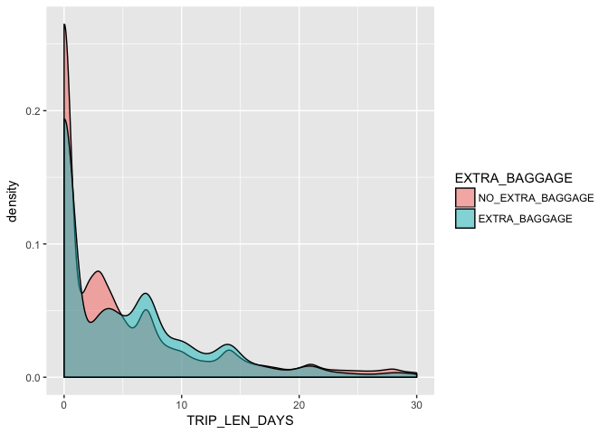

eDreams ODIGEO Baggage Likelihood Predictive Model
================
Stéphane Couvreur
June 15th, 2018

Exploratory Data Analysis
=========================

Plotting and visualising the distributions of different variables
-----------------------------------------------------------------

Overall proportion of people having booked extra baggage:

``` r
round(prop.table(table(train$EXTRA_BAGGAGE))*100, digits = 1)
```

    ## 
    ## NO_EXTRA_BAGGAGE    EXTRA_BAGGAGE 
    ##             80.4             19.6

Let's see which values do not have such relevance to make the model as parsimonious as possible.

Data which seems irrelevant at first sight:

Severe class imbalance with the two variables TRAIN and PRODUCT
---------------------------------------------------------------

As there is very strong class imbalance within the TRAIN booking binary variable (99.5% in the training set did not book a train).

``` r
round(prop.table(table(train$TRAIN))*100, digits = 1)
```

    ## 
    ## False  True 
    ##  99.5   0.5

Similarly within the PRODUCT variable (98.1% booked a Trip compared to a Dynpack) - both these variables were not considered.

``` r
round(prop.table(table(train$PRODUCT))*100, digits = 1)
```

    ## 
    ## DYNPACK    TRIP 
    ##     1.9    98.1

Maybe those who pick SMS as an extra are more likely to pick other extras ?

``` r
round(prop.table(table(train$SMS, train$EXTRA_BAGGAGE), 1)*100, digits = 1)
```

    ##        
    ##         NO_EXTRA_BAGGAGE EXTRA_BAGGAGE
    ##   False             80.3          19.7
    ##   True              80.5          19.5

It seems that there is not much interesting with SMS confirmation for now. Could it be however that with certain devices more customers book luggage ?

``` r
round(prop.table(table(train$DEVICE, train$EXTRA_BAGGAGE), 1)*100, digits = 1)
```

    ##             
    ##              NO_EXTRA_BAGGAGE EXTRA_BAGGAGE
    ##   COMPUTER               79.5          20.5
    ##   OTHER                  79.5          20.5
    ##   SMARTPHONE             83.2          16.8
    ##   TABLET                 79.6          20.4

Indeed, it seems that on smartphones customers are much less likely to select extra luggage.

Feature engineering
===================

Booking company
---------------

It would be interesting to see if there are significant variations in baggage booking between eDreams (ED), Opodo (OP) or Go Voyage (GO), a string operation could be used on this.

To simplify we assume that there is no local variability between bookings in UK, Italy, Spain, France etc.. Also, extracting different countries would just lead to a categorical factor variable with potentially many levels - which is not so good for a machine learning algorithm. Indeed, there is insteresting subtle variability between different booking websites:

``` r
round(prop.table(table(train$COMPANY, train$EXTRA_BAGGAGE), 1)*100, digits = 1)
```

    ##            
    ##             NO_EXTRA_BAGGAGE EXTRA_BAGGAGE
    ##   EDREAMS               80.6          19.4
    ##   GO_VOYAGE             81.2          18.8
    ##   OPODO                 79.9          20.1
    ##   OTHER                 75.7          24.3

The website variable could be a predictor of our outcome variable. Not understanding the GDS variables, I remove them for now.

Family size
-----------

We investigate a potential relation between infants and baggage, after creating a synthetic variable combining ADULTS + CHILDREN + INFANTS called FAMILY\_SIZE. Adults travelling alone I would assume would be less likely to book luggage, but with one or more children much more likely to get luggage, especially with infants. Indeed from a small table you can see that:

``` r
counts <- table(train$EXTRA_BAGGAGE, train$ADULTS)
barplot(counts, main="Adult Booking Distribution",
        xlab="Number of Adults in Booking", col=c("lightcyan", "lavender"),
        legend = rownames(counts))
```


``` r
round(prop.table(table(train$ADULTS, train$EXTRA_BAGGAGE), 1)*100, digits = 1)
```

    ##    
    ##     NO_EXTRA_BAGGAGE EXTRA_BAGGAGE
    ##   0            100.0           0.0
    ##   1             84.5          15.5
    ##   2             73.2          26.8
    ##   3             74.1          25.9
    ##   4             69.5          30.5
    ##   5             71.7          28.3
    ##   6             63.3          36.7
    ##   7             69.4          30.6
    ##   8             80.0          20.0
    ##   9             73.9          26.1

It seems that the more adults are travelling, the more likely they are to book luggage.

``` r
counts <- table(train$EXTRA_BAGGAGE, train$CHILDREN)
barplot(counts, main="Children Booking Distribution",
        xlab="Number of Children in Booking", col=c("lightcyan", "lavender"),
        legend = rownames(counts))
```


``` r
round(prop.table(table(train$CHILDREN, train$EXTRA_BAGGAGE), 1)*100, digits = 1)
```

    ##    
    ##     NO_EXTRA_BAGGAGE EXTRA_BAGGAGE
    ##   0             80.9          19.1
    ##   1             74.6          25.4
    ##   2             71.8          28.2
    ##   3             72.6          27.4
    ##   4             88.5          11.5
    ##   5              0.0         100.0

``` r
counts <- table(train$EXTRA_BAGGAGE, train$INFANTS)
barplot(counts, main="Infants Booking Distribution",
            xlab="Number of Infants in Booking", col=c("lightcyan", "lavender"),
            legend = rownames(counts))
```


``` r
round(prop.table(table(train$INFANTS, train$EXTRA_BAGGAGE), 1)*100, digits = 1)
```

    ##    
    ##     NO_EXTRA_BAGGAGE EXTRA_BAGGAGE
    ##   0             80.5          19.5
    ##   1             74.6          25.4
    ##   2            100.0           0.0

``` r
boxplot(FAMILY_SIZE ~ EXTRA_BAGGAGE, data=train, main="",
    xlab="Baggage", ylab="Family size")
```


``` r
round(prop.table(table(train$FAMILY_SIZE, train$EXTRA_BAGGAGE), 1)*100, digits = 1)
```

    ##    
    ##     NO_EXTRA_BAGGAGE EXTRA_BAGGAGE
    ##   1             84.7          15.3
    ##   2             74.3          25.7
    ##   3             74.8          25.2
    ##   4             69.1          30.9
    ##   5             71.2          28.8
    ##   6             69.9          30.1
    ##   7             63.5          36.5
    ##   8             77.8          22.2
    ##   9             62.9          37.1

Increased overall family size also seems to bring with it increased probability of extra baggage selection.

Travelling alone
----------------

It would be interesting to see if the adults travelling alone tend to not book luggage as would be my initial assumption - we could create a binary variable IS\_ALONE. Indeed from extracting this information it seems that we can improve our model as travellers not alone have much more probability of booking luggage.

``` r
round(prop.table(table(train$IS_ALONE, train$EXTRA_BAGGAGE), 1)*100, digits = 1)
```

    ##            
    ##             NO_EXTRA_BAGGAGE EXTRA_BAGGAGE
    ##   NOT_ALONE             73.6          26.4
    ##   ALONE                 84.7          15.3

Trip length
-----------

Using an engineered feature

``` r
ggplot(train, aes(x = TRIP_LEN_DAYS, fill = EXTRA_BAGGAGE)) + geom_density(alpha = 0.5) + xlim(0, 30)
```

    ## Warning: Removed 2607 rows containing non-finite values (stat_density).



Flight type and distance
------------------------

I would imagine that flight distance would account for a lot of the variability in luggage selection, as people who travel further I would assume need to carry more than if they are doing a short weekend trip within Europe for instance.

``` r
counts <- table(train$EXTRA_BAGGAGE, train$HAUL_TYPE)
barplot(counts, main="Haul Booking Distribution",
            xlab="Haul Type", col=c("lightcyan", "lavender"),
            legend = rownames(counts))
```


``` r
round(prop.table(table(train$HAUL_TYPE, train$EXTRA_BAGGAGE), 1)*100, digits = 1)
```

    ##                   
    ##                    NO_EXTRA_BAGGAGE EXTRA_BAGGAGE
    ##   CONTINENTAL                  74.3          25.7
    ##   DOMESTIC                     81.1          18.9
    ##   INTERCONTINENTAL             91.9           8.1

There are quite significant differences here between groups. One can imagine that in intercontinental flights, the luggage from more premium companies will be complimentary so no extra is needed. And for domestic flights it makes sense - travelling at home you might need less luggage.

``` r
counts <- table(train$EXTRA_BAGGAGE, train$TRIP_TYPE)
barplot(counts, main="Trip Booking Distribution",
            xlab="Trip Type", col=c("lightcyan", "lavender"),
            legend = rownames(counts))
```


``` r
round(prop.table(table(train$TRIP_TYPE, train$EXTRA_BAGGAGE), 1)*100, digits = 1)
```

    ##                    
    ##                     NO_EXTRA_BAGGAGE EXTRA_BAGGAGE
    ##   MULTI_DESTINATION             68.1          31.9
    ##   ONE_WAY                       77.8          22.2
    ##   ROUND_TRIP                    82.7          17.3

Interestingly, in round trips customers select extra baggage the least - perhaps they travel lighter as they know their belongings are at home. However much more take luggage on one ways (moving, expatriation or immigration perhaps ?) and even more on multi-destination trips.

As one would imagine, flight DISTANCE seems to follow a skeweved normal distribution with alot of short flights between 0-3000km and then drastic reductions from then onwards.

``` r
hist(train$DISTANCE,
     main = "Air Travel Distance Distribution",
     xlab = "Distance [km]",
     ylab = "No of Bookings",
     col = "lightcyan",
     xlim = c(0,12000))
```


``` r
boxplot(DISTANCE ~ EXTRA_BAGGAGE, data=train, main="Flight Distance Data",
    xlab="Baggage", ylab="Distance [km]")
```


``` r
ggplot(train, aes(x = DISTANCE, fill = EXTRA_BAGGAGE)) + geom_density(alpha = 0.5)
```


As there does not seem to be a clear distinction using flight distance as a continuous variable, we use distance cut into categories to improve our model. We group together values between 0-4000 and 4000+ km to make things even simple.

``` r
train$DISTANCE_CAT <- factor(train$DISTANCE_CAT, levels = c(1,2), labels = c("0-4000km", "4000+ km"))

counts <- table(train$EXTRA_BAGGAGE, train$DISTANCE_CAT)
barplot(counts, main="Distance Category Booking Distribution",
            xlab="Distance", col=c("lightcyan", "lavender"),
            legend = rownames(counts))
```


``` r
round(prop.table(table(train$DISTANCE_CAT, train$EXTRA_BAGGAGE), 1)*100, digits = 1)
```

    ##           
    ##            NO_EXTRA_BAGGAGE EXTRA_BAGGAGE
    ##   0-4000km             78.2          21.8
    ##   4000+ km             93.8           6.2

Building the model
==================

Random subsampling to balance classes
-------------------------------------

``` r
table(train$EXTRA_BAGGAGE)
```

    ## 
    ## NO_EXTRA_BAGGAGE    EXTRA_BAGGAGE 
    ##            40201             9799

``` r
# Downsampling to balance both classes
down_train <- downSample(x = train[, -ncol(train)],
                         y = train$EXTRA_BAGGAGE)
down_train <- subset(down_train, select = -c(Class))
# There is now no class imbalance in the subsample
table(down_train$EXTRA_BAGGAGE)
```

    ## 
    ## NO_EXTRA_BAGGAGE    EXTRA_BAGGAGE 
    ##             9799             9799

Logisitic Regression
--------------------

Using all the features we deemed significant and our engineered classes, we obtain the following model:

``` r
# 80/20 train/validation set split
validation <- train[40001:50000,]
train <- train[0:40000,]

model <- glm(EXTRA_BAGGAGE ~ factor(HAUL_TYPE) + factor(TRIP_TYPE) +
             factor(DISTANCE_CAT) + factor(DEVICE) + factor(COMPANY) +
             FAMILY_SIZE + factor(IS_ALONE) + factor(SMS),
             data = train,
             family = binomial(link = "logit"))
summary(model)
```

    ## 
    ## Call:
    ## glm(formula = EXTRA_BAGGAGE ~ factor(HAUL_TYPE) + factor(TRIP_TYPE) + 
    ##     factor(DISTANCE_CAT) + factor(DEVICE) + factor(COMPANY) + 
    ##     FAMILY_SIZE + factor(IS_ALONE) + factor(SMS), family = binomial(link = "logit"), 
    ##     data = train)
    ## 
    ## Deviance Residuals: 
    ##     Min       1Q   Median       3Q      Max  
    ## -1.2898  -0.7275  -0.5603  -0.3066   2.5778  
    ## 
    ## Coefficients:
    ##                                    Estimate Std. Error z value Pr(>|z|)
    ## (Intercept)                        -0.43415    0.07434  -5.840 5.22e-09
    ## factor(HAUL_TYPE)DOMESTIC          -0.38024    0.03228 -11.779  < 2e-16
    ## factor(HAUL_TYPE)INTERCONTINENTAL  -1.11754    0.04869 -22.952  < 2e-16
    ## factor(TRIP_TYPE)ONE_WAY           -0.31185    0.05851  -5.330 9.81e-08
    ## factor(TRIP_TYPE)ROUND_TRIP        -0.69506    0.05713 -12.167  < 2e-16
    ## factor(DISTANCE_CAT)4000+ km       -0.53673    0.06848  -7.838 4.59e-15
    ## factor(DEVICE)OTHER               -13.22014   70.40613  -0.188    0.851
    ## factor(DEVICE)SMARTPHONE           -0.21695    0.03298  -6.579 4.74e-11
    ## factor(DEVICE)TABLET               -0.05413    0.05499  -0.984    0.325
    ## factor(COMPANY)GO_VOYAGE            0.35031    0.04395   7.970 1.58e-15
    ## factor(COMPANY)OPODO                0.18525    0.03019   6.136 8.48e-10
    ## factor(COMPANY)OTHER               13.44748   70.40618   0.191    0.849
    ## FAMILY_SIZE                         0.08606    0.01777   4.843 1.28e-06
    ## factor(IS_ALONE)ALONE              -0.52166    0.03857 -13.526  < 2e-16
    ## factor(SMS)True                    -0.01255    0.02604  -0.482    0.630
    ##                                      
    ## (Intercept)                       ***
    ## factor(HAUL_TYPE)DOMESTIC         ***
    ## factor(HAUL_TYPE)INTERCONTINENTAL ***
    ## factor(TRIP_TYPE)ONE_WAY          ***
    ## factor(TRIP_TYPE)ROUND_TRIP       ***
    ## factor(DISTANCE_CAT)4000+ km      ***
    ## factor(DEVICE)OTHER                  
    ## factor(DEVICE)SMARTPHONE          ***
    ## factor(DEVICE)TABLET                 
    ## factor(COMPANY)GO_VOYAGE          ***
    ## factor(COMPANY)OPODO              ***
    ## factor(COMPANY)OTHER                 
    ## FAMILY_SIZE                       ***
    ## factor(IS_ALONE)ALONE             ***
    ## factor(SMS)True                      
    ## ---
    ## Signif. codes:  0 '***' 0.001 '**' 0.01 '*' 0.05 '.' 0.1 ' ' 1
    ## 
    ## (Dispersion parameter for binomial family taken to be 1)
    ## 
    ##     Null deviance: 39548  on 39999  degrees of freedom
    ## Residual deviance: 36928  on 39985  degrees of freedom
    ## AIC: 36958
    ## 
    ## Number of Fisher Scoring iterations: 13

``` r
validation$PREDICTION <- predict(model, validation, type="response")

ggplot(validation, aes(x = PREDICTION, fill = EXTRA_BAGGAGE)) + geom_density(alpha = 0.5)
```


``` r
rocobj <- roc(factor(validation$EXTRA_BAGGAGE), validation$PREDICTION, ci=TRUE)

plot(roc(factor(validation$EXTRA_BAGGAGE),
     validation$PREDICTION,
     ci=TRUE, direction="<"),
     col="black",
     print.auc=TRUE,
     xlab="Specificity",
     ylab="Sensitivity",
     main="ROC Curve")
```


We can confirm from this that SMS is not significant in our model as shown by the p-value (), we can therefore remove it. All other features are highly significant (\*\*\* corresponing to p&lt;0.001), so we choose to keep them in our model.

Looking at the odds ratio table, a unit increase in family size brings a 9.0% \[95% CI 5.2 - 12.8\] increase in probability of booking luggage after adjusting for our other features.

After a preliminary 80/20 train/validation split for internal validation this logistic regression model gives an AUC of:

``` r
rocobj$auc
```

    ## Area under the curve: 0.6911

``` r
rocobj$ci
```

    ## 95% CI: 0.6788-0.7033 (DeLong)

Overall one of the challenges of building this model is that there is strong class imbalance in our primary outcome - indeed it might be interesting to try a more advanced machine learning model with the data, such as gradient boosted machines for instance. With more time, one would perhaps consider a different sampling strategy to better balance both outcomes, or perhaps an upsampling technique to generate new booking data where extra baggage was selected.
